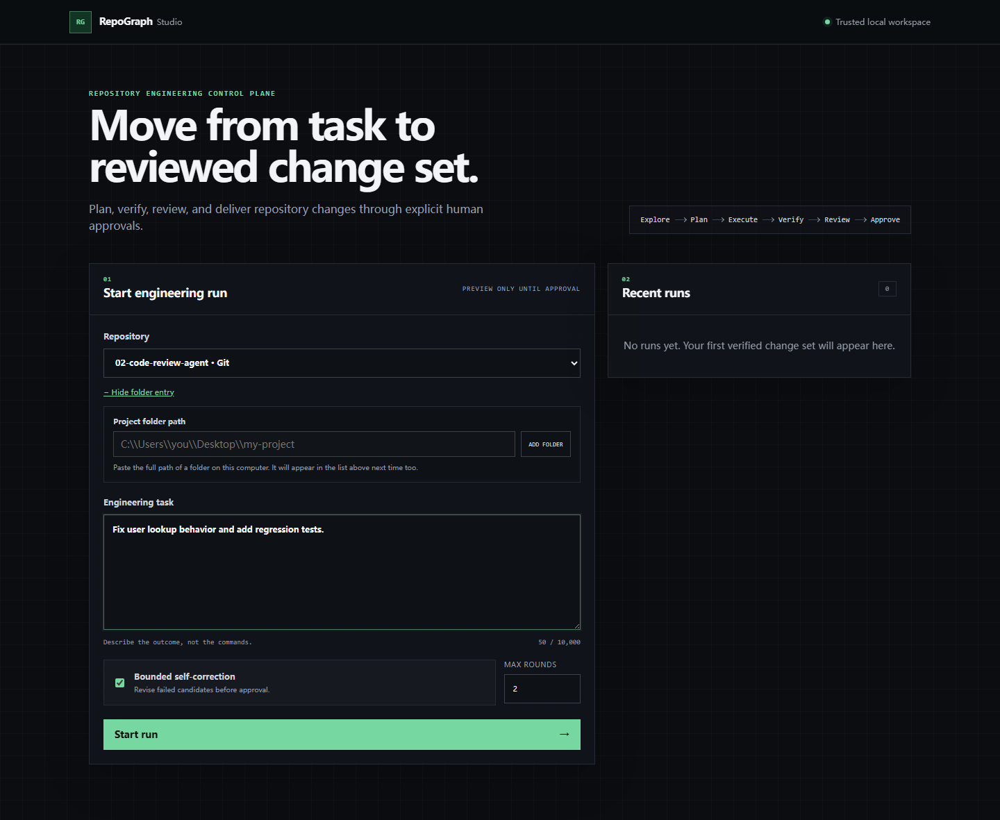
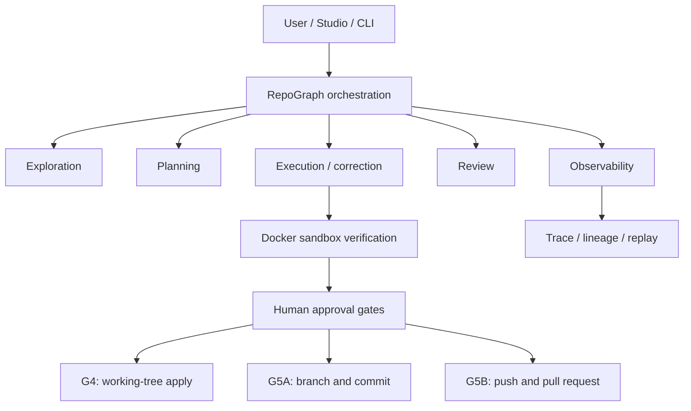

# RepoGraph

## Autonomous Repository Engineering Agent

RepoGraph is a local, repository-aware engineering agent that separates LLM
reasoning from deterministic execution and human-approved mutation. It explores
a codebase, creates a structured `EngineeringPlan`, builds a bounded multi-file
`Candidate`, verifies it, reviews it, and can self-correct. Applying changes,
creating a Git commit, and publishing a GitHub pull request remain three
independent approval gates.

The default portfolio demo is deterministic, offline, preview-only, and uses
the real hardened Docker sandbox. A live model is optional and may incur API
charges.

## Studio preview



## Key capabilities

- Repository-aware exploration and task-grounded planning
- Multi-file candidate generation and bounded self-correction
- Ruff, Bandit, and targeted test verification
- Hardened Docker execution with fail-closed behavior
- Transactional apply plus separate local Git and GitHub delivery gates
- FastAPI + Next.js Studio backed by local SQLite state
- Evaluation harness, hierarchical traces, artifact lineage, and replay

## Architecture



The controller runs on the trusted host. Repository-controlled verification runs
inside the Docker sandbox. RepoGraph does not mount the Docker socket into a
controller container. See [Architecture](docs/ARCHITECTURE.md) and
[Security](SECURITY.md).

## Quickstart (Windows-first)

Validated environment: Windows, PowerShell, Python 3.13, Docker Desktop with
WSL2, and Node/npm. Core Python components are portable in design; Linux and
macOS are not release-validated by this project.

1. Install Python 3.10 or newer, Node/npm, Git, and Docker Desktop.
2. From the repository root, create and activate the environment:

   ```powershell
   python -m venv .venv
   .\.venv\Scripts\Activate.ps1
   python -m pip install -r requirements.txt
   ```

3. Install Studio dependencies:

   ```powershell
   Set-Location .\studio
   npm install
   Set-Location ..
   ```

4. Build and test the sandbox:

   ```powershell
   .\.venv\Scripts\python.exe -m sandbox doctor
   .\.venv\Scripts\python.exe -m sandbox build
   .\.venv\Scripts\python.exe -m sandbox self-test
   ```

5. Run the unified prerequisite check:

   ```powershell
   .\scripts\doctor.ps1
   ```

6. Run the deterministic preview demo:

   ```powershell
   .\scripts\demo.ps1 -Fresh
   ```

7. Launch Studio:

   ```powershell
   .\scripts\start-studio.ps1
   ```

No API credential is required for doctor, the deterministic demo, Studio
inspection, trace inspection, or replay. Copy `.env.example` to `.env` only
when you want live model or GitHub delivery configuration.

## Unified developer entrypoints

```powershell
.\scripts\doctor.ps1
.\scripts\demo.ps1
.\scripts\start-studio.ps1
.\scripts\release-check.ps1

.\.venv\Scripts\python.exe -m repograph doctor
.\.venv\Scripts\python.exe -m repograph demo --sandbox docker --fresh
.\.venv\Scripts\python.exe -m repograph release-check
```

The scripts contain orchestration only; core behavior remains in the existing
Python modules.

## Deterministic demo

The fixture task changes two Python files: it filters non-positive cart
quantities and adds a stable summary renderer. The fixed structured model is
`deterministic/fake-structured-v1`. The demo uses real plan/candidate schemas,
temporary workspace materialization, Ruff/Bandit, targeted tests, tracing,
lineage, and replay.

Defaults:

- Docker sandbox, with no silent host fallback
- Preview only: no G4 apply, G5A commit, or G5B publication
- Fresh state deletes only the demo-specific namespace
- Zero LLM and OpenAI calls

If Docker is unavailable, the secure demo reports `BLOCKED`. Explicit host mode
is available for development only:

```powershell
.\scripts\demo.ps1 -Sandbox host
```

It prints `WARNING: Host mode is not a security sandbox.` See
[Demo guide](docs/DEMO.md).

## Studio

`start-studio.ps1` checks ports and dependencies, starts the FastAPI backend and
Next.js frontend, prints their URLs, and cleans up both children on exit. Studio
uses:

- RepoGraph core orchestration
- FastAPI backend on port 8000 by default
- Next.js frontend on port 3000 by default
- local SQLite state outside the configured workspace
- host-side verification for trusted local repositories

The launcher selects the RepoGraph directory by default. To work on another
local project, click **Add a local project folder** under **Repository** and
paste its full folder path. Studio remembers added folders in its local data
directory, so they remain selectable after a restart. The folder must exist on
the same computer as the Studio backend.

## Sandbox quickstart

```powershell
.\.venv\Scripts\python.exe -m sandbox doctor
.\.venv\Scripts\python.exe -m sandbox build
.\.venv\Scripts\python.exe -m sandbox self-test
```

Docker mode enforces network-none, capability drop, no-new-privileges, a
read-only root filesystem, non-root execution, CPU/memory/PID limits, hard
timeouts, bounded output, and a secret-filtered environment. It fails closed.

If Docker works but `python:3.13-slim` cannot be pulled, check Docker Hub
connectivity, proxy/VPN policy, authentication, and access to
`auth.docker.io` and `registry-1.docker.io`.

## Observability quickstart

The demo prints its trace ID, candidate artifact ID, and state root.

```powershell
python -m observability --state-root <demo-state-root> runs
python -m observability --state-root <demo-state-root> show <run-id>
python -m observability --state-root <demo-state-root> artifacts <run-id>
python -m observability --state-root <demo-state-root> lineage <run-id>
python -m observability --state-root <demo-state-root> export <run-id> --output trace.jsonl
python -m observability --state-root <demo-state-root> replay <run-id> --candidate <artifact-id>
```

Replay re-runs deterministic verification from the recorded checkpoint. It does
not replay or reconstruct LLM reasoning.

## Approval workflow

```text
Preview
  |
  v
G4 approval (--approve)
  |
  v
Working-tree apply

SEPARATE

G5A approval (--approve-git-delivery)
  |
  v
Branch / commit

SEPARATE

G5B approval (--approve-remote-delivery)
  |
  v
Push / pull request
```

There is no automatic chaining, auto-apply, auto-commit, auto-push, or automatic
pull-request creation.

## Live model mode (explicit opt-in)

Copy `.env.example` to `.env`, set your provider values, and invoke an existing
live Agent command such as:

```powershell
python agent.py --repo <trusted-repository> --plan-task "Describe the change"
```

Live mode may incur API charges. The H4 release workflow and deterministic demo
do not use live APIs.

## Configuration

The main operator settings are:

| Setting | Purpose |
|---|---|
| `REPOGRAPH_WORKSPACE_ROOT` | repositories Studio may access |
| `REPOGRAPH_STUDIO_DATA_DIR` | Studio SQLite and local state outside the workspace |
| `REPOGRAPH_STATE_ROOT` | trace/artifact state root |
| `REPOGRAPH_SANDBOX_IMAGE` | trusted sandbox image |
| `CODE_REVIEW_LLM_PROVIDER` / `MODEL` | explicit live provider/model |
| `REPOGRAPH_STUDIO_ALLOWED_ORIGIN` | exact frontend origin |

Evaluation campaign settings are documented with the harness, not required for
normal use. `.env.example` contains names and safe placeholders only.

## Evaluation

Authoritative controlled local benchmark, Direct OpenAI, `gpt-5.6-luna`, N=17:

| Variant | First pass | Final |
|---|---:|---:|
| Full | 15/17 | 17/17 |
| No Self-Correction | 16/17 | 16/17 |
| No Exploration | 16/17 | 16/17 |
| No Agentic Test | 16/17 | 16/17 |

For Full, 8 tasks entered correction, 2 were rescued, and 0 regressed. This is
a small controlled exploratory benchmark; the one-task ablation differences
have paired confidence intervals that include zero. The results are not a
production success rate or a general software-engineering accuracy claim. See
[Evaluation](docs/EVALUATION.md).

## Documentation

- [Architecture](docs/ARCHITECTURE.md)
- [Security](SECURITY.md) and [sandbox detail](docs/SANDBOX_SECURITY.md)
- [Evaluation](docs/EVALUATION.md)
- [Demo](docs/DEMO.md)
- [Observability](docs/OBSERVABILITY.md) and [Replay](docs/REPLAY.md)
- [Portfolio and interview guide](docs/PORTFOLIO.md)
- [Project inventory](docs/PROJECT_INVENTORY.md)

## Known limitations

- N=17 controlled benchmark; no official full SWE-bench Docker campaign
- Windows-first validation; Linux/macOS release workflows are unverified
- Docker is a strong local boundary, not a VM or perfect isolation
- local SQLite observability; no distributed execution or multi-tenant auth
- no cloud deployment
- deterministic replay replays verification, not LLM reasoning
- sandbox network-none prevents dependency installation during verification

## License

No software license has been selected. Until the owner chooses one, do not
assume permission beyond applicable law and repository access.
